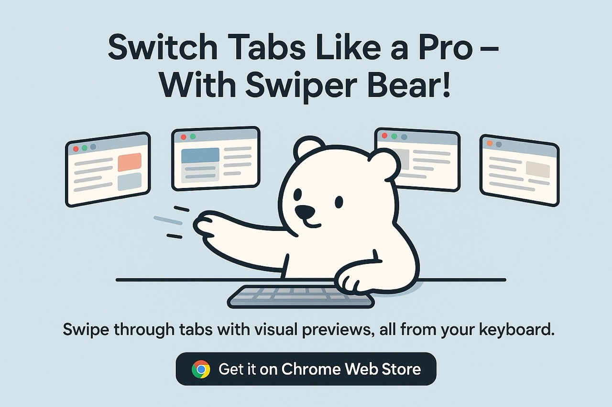

# 🚀 Tab Switcher

A minimal Chrome extension that lets you flip through your most-recently used tabs using a beautiful thumbnail overlay – much like ⌘-Tab on macOS, but for your browser.

## ✨ Features

- ⚡ **Quick keyboard access** – Press **Alt + Q** (configurable in `chrome://extensions/shortcuts`) to bring up the switcher.
- 🖼️ **Visual thumbnails** – Each entry shows a live screenshot, page title and favicon so you can recognise the tab at a glance.
- 🕑 **MRU order** – Tabs are sorted by “last active” so the one you were on a moment ago is always first.
- 🎹 **Arrow-key navigation** – While holding the shortcut you can cycle with **← / → / ↑ / ↓** or press **Enter** to confirm.
- 👆 **One-hand cycling** – Press **Alt + Q** again while the overlay is open to advance to the next tab.
- 🪶 **Lightweight** – Pure JavaScript, no frameworks, no bundler.

## How it works

1. Whenever a tab finishes loading the background service worker captures a small JPEG screenshot and stores it in `chrome.storage.local` alongside the tab’s title and favicon.
2. When the shortcut is pressed the content script is injected (if it isn’t already) and asked to display the overlay.
3. The background script sends the five most-recently-used tabs’ metadata to the content script.
4. The user chooses a tab with the arrow keys/releasing the modifier and the chosen tab is activated via the Chrome Tabs API.

All URLs are supported except internal Chrome pages ( `chrome://…` ) because the extension cannot inject scripts there.

## 🛠️ Installation (unpacked)

Until the extension is published to the Chrome Web Store you can load it locally:

1. Clone or download this repository.
2. Open **chrome://extensions** in Chrome/Edge.
3. Enable **Developer mode** (top-right).
4. Click **Load unpacked** and select the cloned **tab-switcher** folder.
5. (Optional) Change the keyboard shortcut in **chrome://extensions/shortcuts**.

That’s it! Press **Alt + Q** to try it out.

## 📝 License

This project is licensed under the terms of the **MIT License** – see the [LICENSE](LICENSE) file for details.
